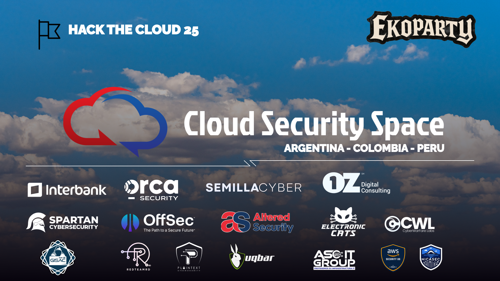

# HackTheCloud25 CTF Manager



## 👥 **Developed by**

**[Gerardo Eliasib](https://gerhsec.com/)** & **[Nelson Contreras](https://www.linkedin.com/in/nelson-contreras/)**  
🌐 **Cloud Security Space - EkoParty 2025**  
📅 October 22-24, 2025 | 📍 CEC - Buenos Aires, Argentina

## ⚠️ **SECURITY WARNING**

> **🚨 CRITICAL NOTICE: This project intentionally deploys VULNERABLE cloud resources for educational purposes.**
>
> - ❌ **DO NOT USE in production environments**
> - ❌ **DO NOT deploy in shared or business-critical accounts**
> - ❌ **DO NOT leave challenges deployed after completion**
> - ⚠️  **These resources contain intentional security misconfigurations**
> - 🛡️  **Use dedicated testing/sandbox accounts ONLY**
>
> **DISCLAIMER**: The authors are **NOT RESPONSIBLE** for any misuse, security breaches, unexpected charges, or damages resulting from the deployment of these intentionally vulnerable resources. Users deploy at their own risk and responsibility.
>
> **RECOMMENDATION**: Always run `terraform destroy` after completing challenges to remove all deployed resources.

---

A comprehensive **intelligent framework** for managing Terraform-based cloud security challenges across AWS, Azure, and GCP platforms with **dynamic dependency resolution** and **automated challenge orchestration**.

## 🚀 Features

- **🌐 Multi-Cloud Support**: Deploy challenges across AWS, Azure, and GCP
- **🤖 Intelligent Dependency Resolution**: Automatically resolves dependencies between challenges
- **⚡ Dynamic Variable Resolution**: Smart resolution of `${challenge-name.output}` references
- **🔧 Automated Management**: Simple CLI commands for deploy/destroy operations
- **📝 Configuration-Driven**: YAML-based challenge definitions
- **✅ Environment Validation**: Automatic credential and dependency checking
- **📊 Detailed Logging**: Comprehensive logging for troubleshooting
- **📈 Status Monitoring**: Real-time challenge deployment status
- **🎯 Output Management**: Easy access to Terraform outputs and endpoints
- **🔗 Challenge Dependencies**: Supports complex multi-challenge scenarios
- **🔄 Auto-Credential Detection**: Smart detection from Azure CLI, AWS CLI, and GCloud

## 🏆 Sponsors - Cloud Security Village

| Categoría | Patrocinador | País |
|-----------|--------------|------|
| 🌟 **Village Core Sponsor** | InterBank | Peru |
| 🛡️ **Village Guardian** | Orca Security | USA |
| 🤝 **Village Partners** | OZ Digital Consulting | USA |
| | Semilla Cyber | Puerto Rico |
| | Offensive Security | USA |
| | Altered Security | India |
| | Spartan-Cybersecurity | Colombia |
| | Electronic Cats | Mexico |
| | CyberWarFare Labs | India |
| | GISAC | Colombia |
| | UqBar | Colombia |
| 🏗️ **Village Builders** | PlainText | Dominican Republic |
| | RedTeamRD | Dominican Republic |
| | AWS Security Latam | Peru |
| 🤝 **Village Allies** | ASC IT GROUP | Colombia |
| | NicaSecurity | Nicaragua |
| | nuvem | Peru |

---

## 🏗️ CTF Architecture Overview

The following diagram illustrates the complete infrastructure and resource deployment across all cloud providers (AWS, Azure, and GCP) for the entire HackTheCloud25 CTF. This comprehensive view shows how all challenges are interconnected and distributed across the multi-cloud environment.


## 📁 Project Structure

```
hackthecloud25/
├── ctf-manager.py                    # Main CLI script
├── requirements.txt                  # Python dependencies
├── CloudSecuritySpace.png            # Logo image
├── .gitignore                       # Git ignore patterns
├── README.md                        # This file
│
├── config/                          # Configuration files
│   ├── challenges.yaml              # Challenge definitions with dependencies
│   └── credentials.yaml.example     # Credentials template
│
├── lib/                             # Framework library
│   ├── __init__.py                  # Library exports
│   ├── terraform_manager.py         # Terraform operations
│   ├── config_loader.py             # Configuration management
│   ├── credential_manager.py        # Credential handling
│   ├── challenge.py                 # Challenge class with dependency resolution
│   └── logger.py                    # Logging utilities
│
├── logs/                            # Log files (auto-generated)
│   └── ctf-manager.log              # Main log file
│
├── terraform/                       # Challenge directories
│   ├── challenge-01-aws-only/       # AWS S3 challenge
│   ├── challenge-01-azure-only/     # Azure Storage + AD challenge
│   ├── challenge-01-gcp-only/       # GCP Cloud Storage challenge
│   ├── challenge-03-azure-only/     # Azure Key Vault privilege escalation
│   └── challenge-05-aws-only/       # AWS binary analysis challenge
│
├── web-content/                     # Web assets for challenges
│   ├── aws-challenge-01/            # AWS web content
│   ├── azure-challenge-01/          # Azure web content
│   ├── azure-challenge-02/          # Azure advanced content
│   └── gcp-challenge-01/            # GCP web content
│
├── modules/                         # Reusable Terraform modules
│   ├── aws/infrastructure/          # AWS shared infrastructure
│   ├── azure/infrastructure/        # Azure shared infrastructure
│   └── gcp/                        # GCP modules
│       ├── infrastructure/
│       ├── firestore/
│       └── private_bucket/
│
└── backend-configs/                 # Terraform backend configs
    ├── aws.hcl
    ├── azure.hcl
    └── gcp.hcl
```

## 🛠️ Setup

### Prerequisites

1. **Terraform** >= 1.5.0 installed and in PATH
2. **Python** >= 3.8
3. **Cloud Provider CLIs** (optional but recommended):
   - AWS CLI configured with profile
   - Azure CLI (`az login`)
   - GCP CLI (`gcloud auth application-default login`)

### Installation

1. **Clone and setup the project**:
   ```bash
   cd /path/to/HackTheCloud25
   pip install -r requirements.txt
   ```

2. **Configure credentials** (copy and customize):
   ```bash
   cp config/credentials.yaml.example config/credentials.yaml
   # Edit credentials.yaml with your cloud provider details
   ```

3. **Set environment variables** (alternative to credentials.yaml):
   ```bash
   # AWS
   export AWS_PROFILE=ekocloudsec
   export AWS_DEFAULT_REGION=us-east-1
   
   # Azure
   export AZURE_SUBSCRIPTION_ID=your-subscription-id
   export AZURE_TENANT_ID=your-tenant-id
   
   # GCP
   export GCP_PROJECT_ID=your-project-id
   export GCP_REGION=us-central1
   ```

4. **Make the CLI executable**:
   ```bash
   chmod +x ctf-manager.py
   ```

## 📋 Usage

### Basic Commands

```bash
# List all available challenges
python ctf-manager.py list

# List challenges by provider
python ctf-manager.py list --provider aws
python ctf-manager.py list --provider azure
python ctf-manager.py list --provider gcp

# List with detailed information
python ctf-manager.py list --details

# Show challenge status
python ctf-manager.py status
python ctf-manager.py status challenge-01-aws-only
```

### Deployment Commands

```bash
# Deploy a specific challenge
python ctf-manager.py deploy challenge-01-aws-only

# Deploy all challenges for a provider
python ctf-manager.py deploy --provider aws
python ctf-manager.py deploy --provider azure
python ctf-manager.py deploy --provider gcp

# Auto-approve deployments (skip confirmation)
python ctf-manager.py deploy challenge-01-aws-only --auto-approve
python ctf-manager.py deploy --provider aws --auto-approve
```

### Destroy Commands

```bash
# Destroy a specific challenge
python ctf-manager.py destroy challenge-01-aws-only

# Destroy all deployed challenges
python ctf-manager.py destroy --all

# Auto-approve destruction (skip confirmation)
python ctf-manager.py destroy challenge-01-aws-only --auto-approve
python ctf-manager.py destroy --all --auto-approve
```

### Output Commands

```bash
# Get outputs from a deployed challenge
python ctf-manager.py output challenge-01-aws-only

# Get outputs in JSON format
python ctf-manager.py output challenge-01-aws-only --format json
```

### Help

```bash
# General help
python ctf-manager.py --help

# Command-specific help
python ctf-manager.py deploy --help
python ctf-manager.py destroy --help
```

## 🔧 Configuration

### Challenge Configuration (config/challenges.yaml)

Each challenge is defined with the following structure:

```yaml
challenges:
  challenge-name:
    name: "Human-readable challenge name"
    description: "Challenge description"
    provider: "aws|azure|gcp"
    difficulty: "basic|intermediate|advanced"
    directory: "terraform/challenge-directory"
    backend_config: "backend-configs/provider.hcl"
    web_content: "web-content/challenge-content"
    variables:
      key: value
    outputs:
      - output_name
    tags:
      - tag1
      - tag2
```

### Adding New Challenges

1. **Create the Terraform directory**:
   ```bash
   mkdir terraform/challenge-02-aws-lambda
   ```

2. **Add challenge configuration** to `config/challenges.yaml`:
   ```yaml
   challenge-02-aws-lambda:
     name: "Challenge 02 - AWS Lambda Vulnerability"
     description: "Exploit misconfigured Lambda functions"
     provider: "aws"
     difficulty: "intermediate"
     directory: "terraform/challenge-02-aws-lambda"
     backend_config: "backend-configs/aws.hcl"
     web_content: "web-content/aws-challenge-02"
     variables:
       aws_region: "us-east-1"
       aws_profile: "ekocloudsec"
     outputs:
       - lambda_function_name
       - api_gateway_url
     tags:
       - aws
       - lambda
       - api-gateway
   ```

3. **Create Terraform files** in the challenge directory:
   - `main.tf` - Main Terraform configuration
   - `variables.tf` - Variable definitions
   - `outputs.tf` - Output definitions

4. **Test the new challenge**:
   ```bash
   python ctf-manager.py deploy challenge-02-aws-lambda
   ```

## 🔍 Troubleshooting

### Common Issues

1. **Terraform not found**:
   ```
   Error: Terraform is not installed
   ```
   - Install Terraform and ensure it's in your PATH

2. **Missing credentials**:
   ```
   Error: Missing credentials: AZURE_SUBSCRIPTION_ID
   ```
   - Set environment variables or configure `credentials.yaml`

3. **Challenge validation failed**:
   ```
   Error: Challenge directory not found
   ```
   - Verify the directory path in `challenges.yaml`

4. **Backend initialization failed**:
   ```
   Error: Error loading backend config
   ```
   - Verify backend configuration files in `backend-configs/`

### Logging

Logs are written to `logs/ctf-manager.log` and include:
- Command execution details
- Terraform output
- Error messages and stack traces
- Performance timing

View logs:
```bash
tail -f logs/ctf-manager.log
```

### Manual Terraform Operations

If needed, you can still run Terraform manually:

```bash
# Navigate to challenge directory
cd terraform/challenge-01-aws-only

# Traditional workflow
terraform init -backend-config=../../backend-configs/aws.hcl
terraform apply -auto-approve
terraform destroy -auto-approve
```


##  Environment Variables & Credentials

### Authentication Methods

The CTF Manager uses a **hybrid authentication system** that automatically detects credentials:

#### **AWS Credentials**
```bash
# Required environment variables
export AWS_ACCESS_KEY_ID="your-access-key"
export AWS_SECRET_ACCESS_KEY="your-secret-key"

# Optional
export AWS_SESSION_TOKEN="your-session-token"  # For temporary credentials
export AWS_PROFILE="your-profile-name"         # For AWS CLI profile
export AWS_REGION="us-east-1"                  # Default region
```

#### **Azure Credentials (Smart Detection)**
```bash
# Option 1: Environment variables (manual)
export AZURE_SUBSCRIPTION_ID="9e30d389-c701-4ae7-bff4-11bcab76c915"
export AZURE_TENANT_ID="c390256a-8963-4732-b874-85b7b0a4d514"

# Option 2: Azure CLI (automatic detection)
az login  # Framework auto-detects from 'az account show'

# Optional for service principal authentication
export AZURE_CLIENT_ID="your-client-id"
export AZURE_CLIENT_SECRET="your-client-secret"
```

#### **GCP Credentials**
```bash
# Option 1: Service account key file
export GOOGLE_APPLICATION_CREDENTIALS="/path/to/service-account-key.json"

# Option 2: Application default credentials
gcloud auth application-default login

# Required
export GCP_PROJECT_ID="your-project-id"
export GCP_REGION="us-central1"
```

### Credential Priority Order

1. **Credentials file** (`config/credentials.yaml`)
2. **Environment variables** (listed above)
3. **CLI auto-detection** (Azure CLI, AWS Profile, gcloud)

## 🚨 Troubleshooting

### Common Issues & Solutions

#### **"Environment not ready for [provider]"**
```bash
# Check which credentials are missing
python3 ctf-manager.py deploy challenge-01-aws-only

# Error example:
# ERROR - Missing credentials: AWS_ACCESS_KEY_ID, AWS_SECRET_ACCESS_KEY
```

**Solution**: Set the missing environment variables or authenticate with CLI tools.

#### **"Variables not allowed" in terraform.tfvars**
```bash
# The framework resolves ${VAR_NAME} automatically
# No action needed - this should work after our fixes

# If still failing, verify credentials:
az account show  # For Azure
aws sts get-caller-identity  # For AWS
gcloud auth list  # For GCP
```

#### **"terraform.tfstate not found" but resources exist**
The framework uses remote state backends. Resources might exist in cloud but state is stored remotely.

```bash
# Check actual cloud resources
aws s3 ls  # For AWS
az storage account list  # For Azure  
gcloud storage buckets list  # For GCP
```

#### **"No challenges found matching criteria"**
```bash
# Verify challenges.yaml is valid
python3 ctf-manager.py list --details

# Check specific provider
python3 ctf-manager.py list --provider aws
```

### Debug Mode

Enable verbose logging:
```bash
# Check logs for detailed error information
tail -f logs/ctf-manager.log

# Enable debug output (if you add --debug flag)
python3 ctf-manager.py deploy challenge-01-aws-only --debug
```

### Credential Validation

Test credentials before deployment:
```bash
# AWS
aws sts get-caller-identity

# Azure  
az account show

# GCP
gcloud auth list
gcloud projects list
```

### Required CLI Tools

Ensure all CLI tools are installed and authenticated:

```bash
# Install tools
brew install awscli azure-cli google-cloud-sdk terraform

# Verify installation
aws --version
az --version  
gcloud --version
terraform --version

# Authenticate
aws configure  # or use IAM roles
az login
gcloud auth login
```

## 🎮 **About HackTheCloud25**

**HackTheCloud25** is the official CTF of the **Cloud Security Village** at **EkoParty 2025**, designed to provide a comprehensive hands-on experience in cloud security.

### 🏥 **MediCloudX - The Fictional Company**

All challenges are contextualized within **MediCloudX**, an innovative digital health platform that migrated its critical infrastructure to the cloud. Participants face real-world scenarios involving:

- 🔐 Identity and access management
- 💾 Protection of sensitive patient data
- 🌉 Multi-cloud hybrid architectures
- 📊 Health regulation compliance
- 🚨 Real-time incident response

### 🚩 **CTF Format**
- 👥 **Teams**: 3 members
- ☁️ **Challenges**: 15 distributed across AWS, Azure and GCP (5 per provider)
- 🏅 **Prizes**: Scholarships and recognition for participating teams
- 🎖️ **Certificates**: Electronic badges and recognition

### 🔗 **Important Links**
- 🌐 **Cloud Security Space**: https://cloudsecurityspace.org/
- 🚩 **CTF Platform**: https://ctf.ekocloudsec.com/
- 💻 **GitHub Repository**: https://github.com/Spartan-Cybersecurity/HackTheCloud25

---

## 🤝 Contributing

1. **Add new challenges** following the configuration format
2. **Test thoroughly** before committing
3. **Update documentation** for new features
4. **Follow the existing code style**
5. **Test dependency resolution** for complex challenges

---

## 🙏 **Acknowledgments**

Thanks to all the **sponsors**, **organizers** and **participants** who made this unique learning and professional growth experience in cloud cybersecurity possible.

**Framework developed by:**
- **[Gerardo Eliasib](https://gerhsec.com/)** - Cloud Security Specialist
- **[Nelson Contreras](https://www.linkedin.com/in/nelson-contreras/)** - Cloud Security Architect

**Cloud Security Space - EkoCloudSec Community**

See you in the next edition! 🚀

---

## 📄 License

This project is part of **Cloud Security Space - EkoParty 2025** training materials.

**© 2025 EkoCloudSec Community | Cloud Security Space**